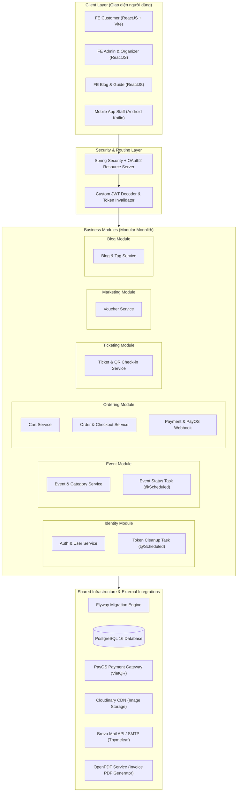
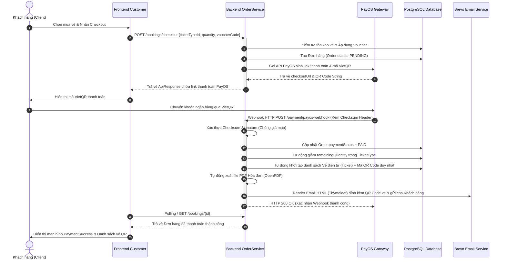
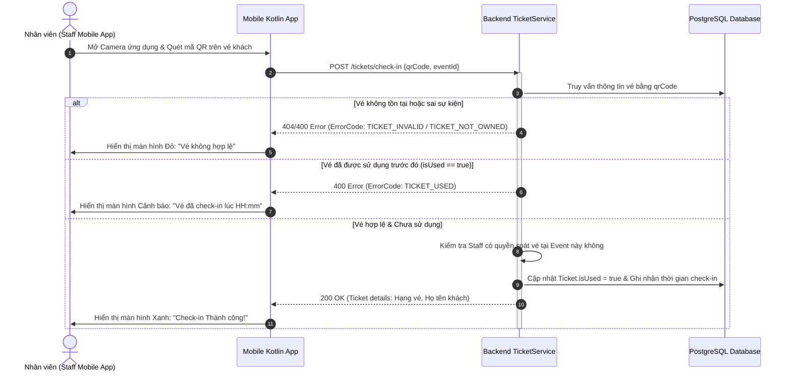
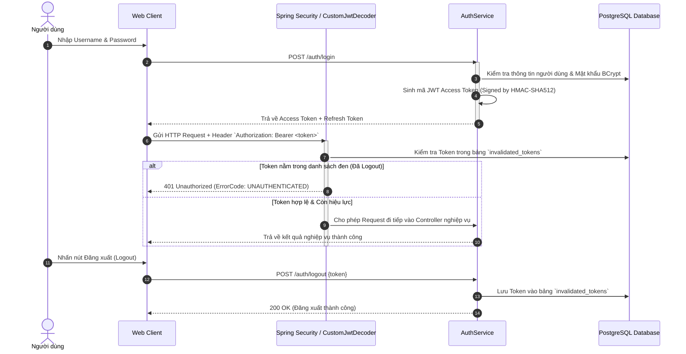
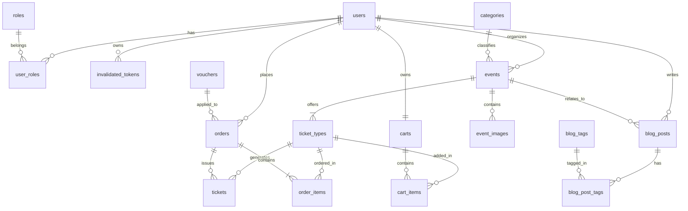

# 🎪 EventHub Backend RESTful API

[](https://www.oracle.com/java/)
[](https://spring.io/projects/spring-boot)
[](https://www.postgresql.org/)
[](https://flywaydb.org/)
[](LICENSE)

**EventHub Backend** là hệ thống máy chủ xử lý toàn bộ logic nghiệp vụ, quản lý bán vé sự kiện trực tuyến, thanh toán VietQR tự động, quản lý giỏ hàng, xuất vé điện tử tích hợp QR Code và phân quyền đa lớp cho nền tảng **EventHub**.

Hệ thống được thiết kế theo kiến trúc **Domain-Driven Layered Modular Monolith**, giúp đảm bảo tính cô lập nghiệp vụ, dễ bảo trì, mở rộng và kiểm thử.

---

## 📑 Mục lục
- [1. Kiến trúc hệ thống (System Architecture)](#1-kiến-trúc-hệ-thống-system-architecture)
- [2. Các luồng nghiệp vụ cốt lõi (Core Sequence Workflows)](#2-các-luồng-nghiệp-vụ-cốt-lõi-core-sequence-workflows)
  - [2.1. Luồng Thanh toán VietQR (PayOS) & Tự động phát hành vé QR](#21-luồng-thanh-toán-vietqr-payos--tự-động-phát-hành-vé-qr)
  - [2.2. Luồng Kiểm tra & Soát vé (Event Check-in)](#22-luồng-kiểm-tra--soát-vé-event-check-in)
  - [2.3. Luồng Xác thực & Bảo mật JWT (Authentication & Security)](#23-luồng-xác-thực--bảo-mật-jwt-authentication--security)
- [3. Cơ sở dữ liệu & Database Migration (Flyway)](#3-cơ-sở-dữ-liệu--database-migration-flyway)
- [4. Danh sách các Module nghiệp vụ](#4-danh-sách-các-module-nghiệp-vụ)
- [5. Công nghệ & Thư viện sử dụng (Tech Stack)](#5-công-nghệ--thư-viện-sử-dụng-tech-stack)
- [6. Cấu trúc thư mục mã nguồn](#6-cấu-trúc-thư-mục-mã-nguồn)
- [7. Hướng dẫn cài đặt & Chạy dự án](#7-hướng-dẫn-cài-đặt--chạy-dự-án)

---

## 1. Kiến trúc hệ thống (System Architecture)

Hệ thống áp dụng kiến trúc **Modular Monolith** kết hợp với **Layered Domain-Driven Design (DDD)**. Mỗi miền nghiệp vụ (Module) được đóng gói độc lập với 4 lớp kiến trúc chuẩn hóa:



---

## 2. Các luồng nghiệp vụ cốt lõi (Core Sequence Workflows)

### 2.1. Luồng Thanh toán VietQR (PayOS) & Tự động phát hành vé QR



---

### 2.2. Luồng Kiểm tra & Soát vé (Event Check-in)



---

### 2.3. Luồng Xác thực & Bảo mật JWT (Authentication & Security)



---

## 3. Cơ sở dữ liệu & Database Migration (Flyway)

Hệ thống sử dụng **PostgreSQL 16** làm cơ sở dữ liệu quan hệ chính. Toàn bộ cấu trúc bảng và dữ liệu khởi tạo được quản lý tự động bằng **Flyway Migration** tại thư mục `src/main/resources/db/migration`:

* `V1__init_schema.sql`: Khởi tạo 17 bảng dữ liệu quan hệ, thiết lập khóa chính (`PK`), khóa ngoại (`FK`), các chỉ mục B-Tree (`INDEX`) tối ưu tìm kiếm và ràng buộc toàn vẹn dữ liệu.
* `V2__seed_data.sql`: Cung cấp dữ liệu mẫu khởi tạo (Tài khoản Admin mặc định, các vai trò `ADMIN`, `ORGANIZER`, `STAFF`, `CUSTOMER`, các danh mục sự kiện mẫu).



---

## 4. Danh sách các Module nghiệp vụ

| STT | Module Name | Package Path | Chức năng chính |
| :-: | :--- | :--- | :--- |
| **1** | **Identity** | `modules.identity` | Đăng ký, Đăng nhập, Xác thực Email OTP, Quên mật khẩu, Thu hồi JWT Token, Phân quyền RBAC (`ADMIN`, `ORGANIZER`, `STAFF`, `CUSTOMER`). |
| **2** | **Event** | `modules.event` | Quản lý danh mục, Tạo/Sửa sự kiện, Upload banner Cloudinary, Tìm kiếm linh hoạt JPA Specification, Tác vụ tự động cập nhật trạng thái sự kiện (`@Scheduled`). |
| **3** | **Ordering** | `modules.ordering` | Quản lý giỏ hàng (`Cart`), Thanh toán đơn hàng, Tích hợp PayOS VietQR Webhook, Thống kê doanh thu đa chiều cho Admin & Organizer. |
| **4** | **Ticketing** | `modules.ticketing` | Tự động phát hành vé điện tử có chứa mã QR duy nhất, API soát vé (`/check-in`) cho ứng dụng Mobile. |
| **5** | **Marketing** | `modules.marketing` | Quản lý mã giảm giá (`Voucher`), tính toán chiết khấu theo % hoặc số tiền cố định, kiểm tra điều kiện áp dụng. |
| **6** | **Blog** | `modules.blog` | Quản lý bài viết tin tức, gắn thẻ phân loại (`BlogTag`), quy trình duyệt bài từ Ban tổ chức. |

---

## 5. Công nghệ & Thư viện sử dụng (Tech Stack)

* **Core Framework**: Java 17, Spring Boot 3.4.5
* **Database & Migration**: PostgreSQL 16, Flyway Database Migration
* **Security & Auth**: Spring Security, OAuth2 Resource Server, JWT (HMAC-SHA512), BCrypt
* **API Documentation**: SpringDoc OpenAPI v2.8.0, Swagger UI
* **Integrations & Third-party Services**:
  * **PayOS Java SDK (v1.0.1)**: Thanh toán trực tuyến VietQR & Webhook
  * **Cloudinary (v1.36.0)**: Quản lý CDN và lưu trữ hình ảnh
  * **Brevo (Sendinblue) / Spring Mail**: Gửi email OTP & Vé điện tử với mẫu Thymeleaf HTML
  * **OpenPDF (v1.3.30)**: Tạo và xuất tệp PDF Hóa đơn / Vé tự động
* **Tools & Utilities**: MapStruct (v1.5.5), Lombok, Dotenv, JavaFaker

---

## 6. Cấu trúc thư mục mã nguồn

```text
BE-event-mng/
├── src/main/java/com/sa/event_mng/
│   ├── modules/                    # Kiến trúc Modular Monolith
│   │   ├── identity/               # Module Xác thực & Phân quyền
│   │   ├── event/                  # Module Quản lý Sự kiện
│   │   ├── ordering/               # Module Đơn hàng & Thanh toán
│   │   ├── ticketing/              # Module Vé điện tử & Check-in
│   │   ├── marketing/              # Module Mã giảm giá (Voucher)
│   │   └── blog/                   # Module Bài viết & Tin tức
│   ├── shared/                     # Dùng chung toàn hệ thống
│   │   ├── dto/                    # Wrapper ApiResponse<T>
│   │   ├── exception/              # GlobalExceptionHandler & ErrorCode
│   │   ├── infrastructure/         # Cloudinary, PayOS, PDF, Email
│   │   └── config/                 # SecurityConfig, WebConfig, OpenApiConfig
│   ├── task/                       # Scheduled Tasks (EventStatus, Ping)
│   └── EventMngApplication.java    # Application Main Class
└── src/main/resources/
    ├── db/migration/               # Script SQL của Flyway Migration
    └── templates/                  # Template Email HTML Thymeleaf
```

---

## 7. Hướng dẫn cài đặt & Chạy dự án

### Yêu cầu môi trường
* **Java**: JDK 17+
* **Database**: PostgreSQL 16+
* **Build tool**: Maven 3.8+

### 1. Cấu hình biến môi trường (`.env` hoặc `application.properties`)
Tạo tệp `.env` tại thư mục gốc của dự án `BE-event-mng/.env`:

```env
SPRING_DATASOURCE_URL=jdbc:postgresql://localhost:5432/event_mng
SPRING_DATASOURCE_USERNAME=postgres
SPRING_DATASOURCE_PASSWORD=your_postgres_password

# JWT Security
JWT_SIGNER_KEY=your_secret_key_minimum_64_characters_long_for_hmac_sha512

# PayOS Integration
PAYOS_CLIENT_ID=your_payos_client_id
PAYOS_API_KEY=your_payos_api_key
PAYOS_CHECKSUM_KEY=your_payos_checksum_key

# Cloudinary Integration
CLOUDINARY_CLOUD_NAME=your_cloudinary_name
CLOUDINARY_API_KEY=your_cloudinary_api_key
CLOUDINARY_API_SECRET=your_cloudinary_api_secret

# Email Configuration
SPRING_MAIL_HOST=smtp-relay.brevo.com
SPRING_MAIL_PORT=587
SPRING_MAIL_USERNAME=your_brevo_email
SPRING_MAIL_PASSWORD=your_brevo_smtp_key
```

### 2. Chạy ứng dụng
Biên dịch và khởi chạy dự án (Flyway sẽ tự động chạy migration tạo CSDL):

```bash
# Biên dịch dự án
mvn clean install -DskipTests

# Chạy ứng dụng Spring Boot
mvn spring-boot:run
```

### 3. Xem Tài liệu API (Swagger UI)
Sau khi ứng dụng khởi chạy thành công tại cổng `8080`, mở trình duyệt truy cập:

```text
http://localhost:8080/swagger-ui/index.html
```
